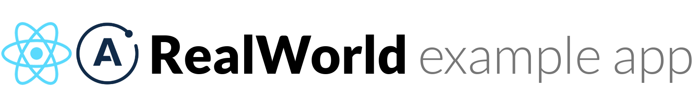

# 

> ### React + Apollo codebase containing real world examples (CRUD, auth, advanced patterns, etc) that adheres to the [RealWorld](https://github.com/gothinkster/realworld) spec and GraphQL API.

### [Demo](https://realworld-react-apollo.herokuapp.com/)&nbsp;&nbsp;&nbsp;&nbsp;[RealWorld](https://github.com/gothinkster/realworld)

This codebase was created to demonstrate a fully fledged fullstack application built with React + Apollo including CRUD operations, authentication, routing, pagination, and more.

# Getting started

You can view a live demo over at https://realworld-react-apollo.herokuapp.com/

To get the frontend running locally:

1. Clone this repo
2. `npm install` to install required dependencies
3. `npm start` to start the development server

### Making requests to the backend API

For convenience, we have a live GraphQL API server running at https://realworld-graphql.herokuapp.com/graphql for the application to make requests against. You can view [the GraphQL API spec here](https://github.com/dostu/rails-graphql-realworld-example-app/blob/master/GRAPHQL_API_SPEC.md) which contains the schema for the server.

The source code for the backend server (available for Ruby on Rails) can be found in the [this repo](https://github.com/dostu/rails-graphql-realworld-example-app).

If you want to change the API URL to a local server, simply set `REACT_APP_GRAPHQL_URL` env variable to another URL.
`REACT_APP_GRAPHQL_URL=http://localhost:3000/graphql yarn start`
